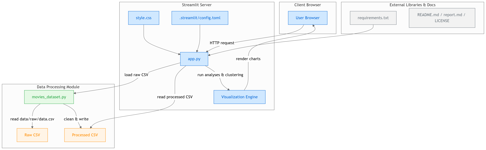

# 🧬 De Genética a Dados: Minha Jornada Analisando a Netflix

**Como uma graduanda em Ciências Biológicas descobriu padrões nos gêneros da Netflix**

Olá! Me chamo Maria Rodrigues, sou graduanda em Ciências Biológicas com foco em Genética e apaixonada por Bioinformática. Este projeto representa minha transição para a área de dados, combinando:

- 🧪 Minha experiência em análise de padrões genéticos
- 📊 Técnicas de bioinformática aplicadas a dados culturais
- 🎬 Minha paixão pessoal por filmes e séries

## 🌱 Como Tudo Começou

Durante minha iniciação científica em Bioinformática, percebi que as técnicas que usava para analisar sequências genéticas poderiam ser aplicadas para "sequenciar" os gêneros da Netflix. Afinal:

"Analisar gêneros de filmes não é tão diferente de estudar genes até porque ambos envolvem padrões, combinações e evolução ao longo do tempo."

## 🔍 O Que Você Vai Encontrar Aqui

Um dashboard interativo que conta histórias através de dados, revelando:

- Como os **padrões de popularidade** se assemelham a expressão gênica
- A **"filogenia" dos gêneros** (quais tendem a aparecer juntos)
- **Mutações culturais** (como gêneros evoluem com o tempo)

### 📊 Arquitetura do Projeto

O diagrama abaixo resume o fluxo de dados e a arquitetura modular deste projeto:

- 🔄 **movies_dataset.py**: responsável por ler o CSV bruto, realizar o pré-processamento dos dados (limpeza, padronização, imputação, etc.) e salvar uma versão tratada.
- 📊 **app.py**: carrega os dados processados, executa análises (como clusterização de gêneros) e envia os resultados ao frontend via Streamlit.
- 🎨 **style.css** e **config.toml**: personalizam o layout e comportamento do aplicativo Streamlit.
- 🧩 **Visualization Engine**: gera os gráficos interativos exibidos ao usuário.
- 🌐 **Client Browser**: é onde o usuário interage com o app, visualizando as análises diretamente no navegador.
- 📚 **requirements.txt** e demais documentos: listam as dependências e informações adicionais sobre o projeto.




## 🛠️ Para Iniciar a Análise

```bash
# Clone este repositório (meu primeiro projeto público!)
git clone https://github.com/mulinco/analysis-genre-netflix.git

# Instale as dependências
pip install -r requirements.txt

# Execute o dashboard
streamlit run app.py
```

## 📚 Meu Processo de Aprendizado

| Habilidade Biológica    | Equivalente em Dados   | O Que Aprendi                                      |
|-------------------------|------------------------|----------------------------------------------------|
| Análise de sequências   | Processamento de texto | Padronizar gêneros como faço com genes             |
| Alinhamento múltiplo    | Data cleaning           | Identificar e tratar "mutações" nos dados          |
| Árvores filogenéticas   | Clusterização           | Agrupar gêneros relacionados                       |

## 🤝 Como Você Pode Me Ajudar

Como alguém em transição de carreira, adoraria:

✏️ Feedback sobre minha abordagem analítica

💻 Sugestões para melhorar o código

🔗 Conexões com oportunidades em análise de dados


Vamos conversar! [mariarodrigues.ufrj@gmail.com](mailto:mariarodrigues.ufrj@gmail.com) | [Meu LinkedIn](https://linkedin.com/in/mariaclararodrigues3113) 


